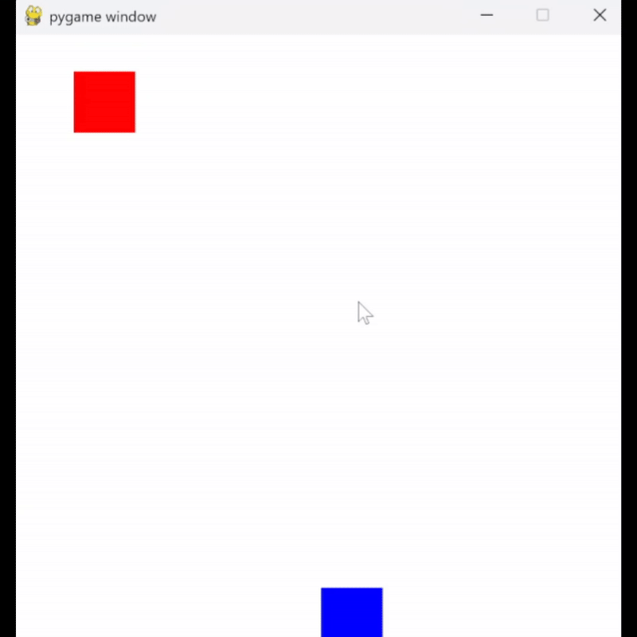

# 🎮 Pygame Simple Dodge Game

A minimalistic arcade game built with **Pygame**, where the player avoids falling obstacles.  

## 🚀 Gameplay

Move the blue square (player) left and right to dodge the falling red squares (obstacles). The game ends when the obstacle hits the player.

## 🖥️ Screenshot / Gameplay GIF



## 🎯 Features

- Simple gameplay mechanics
- Collision detection
- Keyboard controls (⬅️, ➡️)
- Smooth animation (30 FPS)

## 🛠️ Requirements

Install dependencies:

```sh
pip install -r requirements.txt
